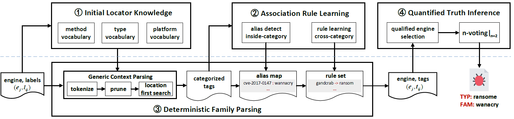

# Dynamic-label Malware Annotation: Joint Deterministic Family Parsing and Quantified Truth Inference

This repository is the official implementation of Dynamic-label Malware Annotation: Joint DeterministicFamily Parsing and Quantified Truth Inference, which has been submitted in *ACM Transactions on Privacy and Security*.

*architecture*

## Installation
1. [Deterministic Family Parsing](dfparser/README.md)
2. [Quantified Truth Inference](qvote/README.md)

## Evaluation
1. [Deterministic Family Parsing](dfparser/README.md)
2. [Quantified Truth Inference](qvote/README.md)