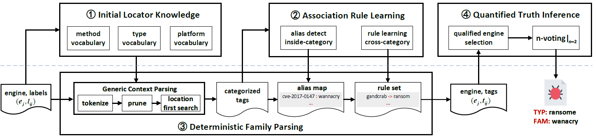

# Deterministic Family Parsing

This repository is the official implementation of Deterministic Family Parsing for Dynamic-label Malware Annotation (DMA).



*DMA Architecture*

## Installation
- Getting the code
```shell
git clone https://github.com/jyker/dma.git
```
- Install [poetry](https://python-poetry.org/docs/#installation) (Poetry is a tool for dependency management and packaging in Python.)

- Install requirements
```shell
cd dma/dfparser
poetry install
```
## Evaluation
```
poetry shell
cd example
python parse_malgenome.py
```